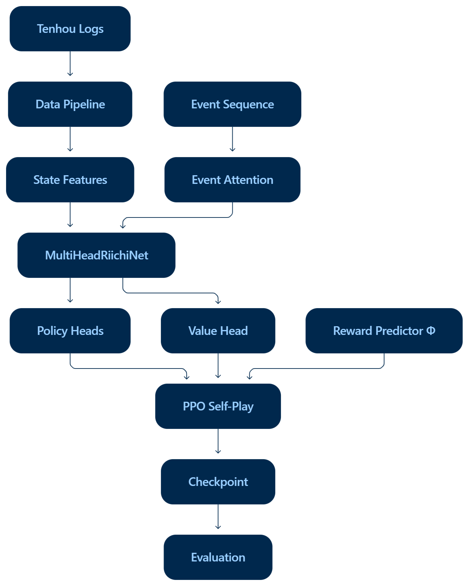

# Kamikaze — Riichi Mahjong AI（神风 · 日麻 AI）

独立实现的**日麻 AI** 与**可独立运行的日麻规则引擎**，基于天凤（Tenhou）对局日志，以 SL（监督学习）初始化和 PPO 自对弈强化学习构建完整系统。

> **Status**
> - **Engineering Validation: Complete**
> - **Scientific Evaluation: Deferred**
> - **No claim is made that the RL policy outperforms the SL baseline.**
>
> 详见 [`PROJECT_STATUS.md`](./PROJECT_STATUS.md)。

---

## Why this project?

本项目聚焦的重点不是堆叠模型规模，而是**构建一条完整、可检查的管线**：从真实对局日志、环境建模，到策略学习、自对弈与可复现评估。目标是把「从数据到系统」的通路做成一个可逐环节检查、可复现、且每一条结论都可追溯的独立研究/工程系统。

---

## Architecture



- **规则引擎**（`src/env/riichi_game.py`）：完整立直麻将规则（立直/一发/宝牌/杠/流局/高点法），与天凤逐条 oracle 验证；通过 **mjai JSON 协议**接入任意外部决策者。
- **模型**（`src/model/net.py`）：共享主干（Stem + 50 Residual Blocks）+ 解耦决策头 + Event 因果注意力旁支，约 21M 参数。
- **训练**：SL 初始化 → Φ 全局奖励预测 → PPO 自对弈（对手池 / 事件注意力 / 稀有动作加权）。

---

## Project Status

> **Frozen at the engineering-validation milestone.**

- **Engineering Validation：Complete** —— 环境、数据管线、SL/Reward/PPO/Self-play、对手池、事件注意力、评估与可复现基础设施、D0 回归、单元测试均达成。
- **Scientific Evaluation：Deferred** —— RL 大规模重训、vs-SL 多 seed 统计评估、ablation、Human 行为分析**未包含在本次发布**。

归因：大型 RL 实验因当前**计算预算与项目时间分配**暂缓（非"环境无法训练"）。README 中任何训练方式与历史表现仅作说明，不构成已证实的科研结论。

---

## Quick Start

> 各模式的**可运行条件**标注如下，避免 clone 后因缺环境误判为项目损坏。

### A. Rule Engine —— ✅ 仓库内即可运行

引擎不依赖任何训练产物，单独导入即可驱动对局：

```python
from env.riichi_game import RiichiGame, RiichiConfig

game = RiichiGame(RiichiConfig(), seed=42)     # 新建一局（东四局制）
while game.phase != "game_end":
    obs = game.state.get_observation()          # 可观察状态（无参 = 当前决策者）
    action = game.random_action()               # 或 game.step({"type": "discard", "tile": 0})
    res = game.step(action)                     # 推进引擎
    for ev in res["events"]:
        print(ev)                               # mjai JSON 事件流
```

- **动作协议**（mjai 风格 JSON）：切牌/立直 `{"type":"discard","tile":0}` / `{"type":"riichi","tile":5}`；吃/碰/杠 `{"type":"pon","tiles":[...]}`；和/过 `{"type":"ron"}` / `{"type":"pass"}`。
- **事件流**：`start_kyoku / tsumo / dahai / reach / chi / pon / ankan / daiminkan / kakan / dora / hora / ryuukyoku / end_kyoku / end_game`；杠按 `ankan/daiminkan/kakan` 区分，鸣牌含 `consumed/from`，与 [mjai.app](https://github.com/mjai/mjai) 对齐。
- **牌编码**：tile136 整数 0–135（`tile = kind×4 + copy`）；赤宝牌固定 id 赤5m=16 / 赤5p=52 / 赤5s=88。
- **默认规则**：赤宝 ON、喰断 ON、喰替 OFF、双响 ON、无切上满贯、役满单倍、西入 ON、连庄制和 ON、起分 25000 / 返し 30000，与天凤一致；可按 `RiichiConfig(kiriage_mangan=True, ...)` 覆盖。

### B. Training —— ⚠️ 需要 NVIDIA/CUDA + 训练数据

```bash
pip install -r requirements.txt
python tools/train_reward_pred.py     # Φ 奖励预测器（Tenhou 27.5K 局牌谱）
python tools/start_rl_train.py        # RL 自对弈（计划 10K 局 / 500 epoch；需 GPU，约数天）
```

### C. Evaluation —— ⚠️ 需要 PyTorch + checkpoints

```bash
python tools/eval_vs_sl.py --a <rl.pt> --b <transfer_final.pt> --games 100 --seeds 3 --event-attn
```

> 本机缺少运行该评估所依赖的 NVIDIA/CUDA 与 checkpoints；具体运行步骤见 `docs/gpu_runbook.md`。

### D. Training Monitor —— ⚠️ 需要训练日志

```bash
python tools/rl_panel_server.py       # render 循环 + http.server:8090；浏览器打开 /rl_train_panel.html
```

### E. RL Inference —— ✅ 随仓库分发的模型可直接运行

加载**已随仓库分发**的 RL 模型（fp16 版，`models/kamikaze_rl_v1_fp16.pt`，~58MB）与引擎对局：

```python
from agent.policy import RiichiPolicy
from env.riichi_game import RiichiGame, RiichiConfig

policy = RiichiPolicy("models/kamikaze_rl_v1_fp16.pt", seed=0, use_event_attn=True)
game = RiichiGame(RiichiConfig(), seed=42)
while game.phase != "game_end":
    game.step(policy(game) if game.turn == 0 else game.random_action())
```

### F. SL model —— ⚠️ 基线模型未随仓库分发

SL 基线（`transfer_final.pt`）为 RL 版的监督学习起点，文件较大**未随仓库分发**，需按 B 的 SL 阶段训练产出，或自行放置到对应路径后再用。

> **模型路径区分**
> - **Bundled（已分发）**：`models/kamikaze_rl_v1_fp16.pt`（RL，fp16）
> - **Training output（未分发）**：`checkpoints/...`（如 SL `transfer_final.pt`、ablation 各变体）
> 只有 `models/kamikaze_rl_v1_fp16.pt` 可在 checkout 后直接运行。

---

## Problem Formulation

日麻（Riichi Mahjong）是不完全信息、多玩家、随机性的序贯决策问题。Kamikaze 以**逐决策策略学习**为目标：给定可观察到的手牌/牌河/副露/宝牌/风，输出动作分布。长程结果（终局点数）由独立的价值模型 Φ 建模，作为自对弈的奖励信号。

---

## Dataset

> **⚠️ Dataset Notice: Tenhou logs are not included in this repository.** 用户须自行按原条款获取并使用天凤（Tenhou）公开对局日志，详见 `docs/data_license_check.md`。

- **来源**：天凤公开对局日志（2026-01 日期段）。
- **规模**：处理后的逐决策记录 **27,579 局**（`transfer_records`）→ 用于 Φ 奖励预测器训练。
- **记录格式**：JSON 行 + gzip，`.jsonl.gz`，每行 = 一个人在当前决策时刻的完整可观察状态（seat/round/honba/scores/oya/riichi_sticks/wall_left/dora/hand/melds/discards/legal_actions/label）。
- **处理管线**：`src/tenhou/`（下载 → 解析 mjlog → 校验 → 提取逐决策记录）；数据不随仓库分发。

---

## Model

### MultiHeadRiichiNet（src/model/net.py）
单模型共享主干 + 多决策头（约 21M 参数，fp32 ~122MB）：

```
输入: 284 通道 × 34 牌位特征（手牌/牌河/副露/宝牌/风/自风/赤宝/危险度…）
  ↓
Stem: Conv1d(284 → 256, k=3)
  ↓
Trunk: 50 × ResidualBlock(256)
  ↓  ← Event 因果注意力注入（可选，默认开）
Decoupled Heads:
  ├─ DiscardHead(34)    切牌头
  ├─ BinaryHead × 7     立直/吃/碰/杠/荣和/自摸/九种九牌（学习执行时机）
  └─ ValueHead(1)       PPO critic
```

### Event Causal Attention（src/model/attn_modules.py）
8 头自注意力，输入公开事件序列（64×46 维），**因果掩码只看过去**；门控注入防 logit 放大失控。

### Φ Reward Predictor（src/model/rl_reward.py，Suphx 式）
GRU(512)×2 + 2 FC；输入 16 维轮级特征（记分板 12 + 手牌 4）；标签 = 终局精算点数；奖励按 Φ(前缀) 差分分配。

> 说明：模型架构是全轮表征共享的，具体差分为事件注意力开关与奖励结构（见 Ablations 的 config 变体）。

---

## Training

- **SL Initialization**：从 Tenhou 职业/高段位牌谱对切牌/立直/吃/碰/杠逐决策监督学习，学人类动作分布作为基线。
- **Reward**（pt 量纲，热可调）：Φ 差分 + 和牌轮 +0.5+min(20,打点/2000) − 被铳轮 −0.5−min(20,铳点/2000)。
- **PPO Self-Play**：向量化（`--vec`，默认 4 局）；对手池 self 60% / past 25% / SL 15%；clip 0.2、GAE(0.99,0.95)、KL 早停 0.5、稀有动作加权 ≤8×、熵 0.01；bias-snap 归中防头冻结；always_win 先学"能和就和"。
- **Hot Reload**：编辑 `logs/rl_hyper.json`（~10s 应用）免重启调节奖励/学习率/等。

> **Observed behavior**：当前开发 checkpoint 表现出**激进、偏重吃碰（meld-heavy）**的打法（副露率高）。这是**观察到的行为特征**，不表示模型已"学会某种最优打法"。

---

## Evaluation

- 主指标 **Mean Rank**（辅 Rank1 / pt 加权胜率），Bootstrap 95% CI。
- 两阶段：pilot（3 seed × 500）→ main（5 seed × 1000）。
- 防泄漏：预处理不跨 split、评估权重不可变、RL 对手池不含测试权重。
- 协议详见 `docs/evaluation_protocol.md`；**本机未执行正式评估**。

---

## Historical Development

早期开发运行曾记录一组初步表现数据（非最终协议、未复现）。**完整历史快照见 [`docs/history.md`](./docs/history.md)**，不作为正式科研结论的组成部分。

---

## Design Decisions

- **Human logs** 提供行为先验；**SL** 提供初始策略；**Φ** 建模长视野结果价值；**PPO** 做自对弈改进；**对手池**降低对单一策略过拟合。
- 评估与训练**分离**；实验可复现（one config ↔ commit ↔ checkpoint ↔ seeds）。
- **没有最终 multi-seed 评估就不作科学结论**。

---

## Limitations

- 大型 RL 重训暂缓；最终 multi-seed RL-vs-SL 评估**未完成**。
- Ablation 研究**未完成**；Human 对比止于行为统计，本次发布未运行。
- 数据与 SL 基线 checkpoint 不随仓库分发。

---

## Repository Structure

```
src/    → agent/policy.py, env/riichi_game.py, model/(net/features/attn/rl_reward/train_rl_vec/…), tenhou/, riichi/
tools/  → eval_vs_sl, eval_sliding, train_reward_pred, rl_panel_server, start_rl_train, rl_watchdog, …
docs/   → evaluation_protocol, experiment_versions, history, tenhou_rules_authoritative, data_license_check, gpu_runbook, …
tests/  → 引擎 oracle 回归测试（28 文件 / 65 测试函数）
configs/→ schema.json + rl_v1 / rl_v1_event_attn / rl_v1_reward_full
models/ → kamikaze_rl_v1_fp16.pt（已分发 RL checkpoint）
```

完整规则说明见 `docs/tenhou_rules_authoritative.md`；到天凤规则差异与许可见 `docs/data_license_check.md`。

---

## 致谢与参考

- 架构参考：**Suphx**（arXiv:2003.13590）、**mjai** 协议、mahjong 库。
- 项目署名与引用：`CITATION.cff`；LICENSE：MIT（代码部分）。